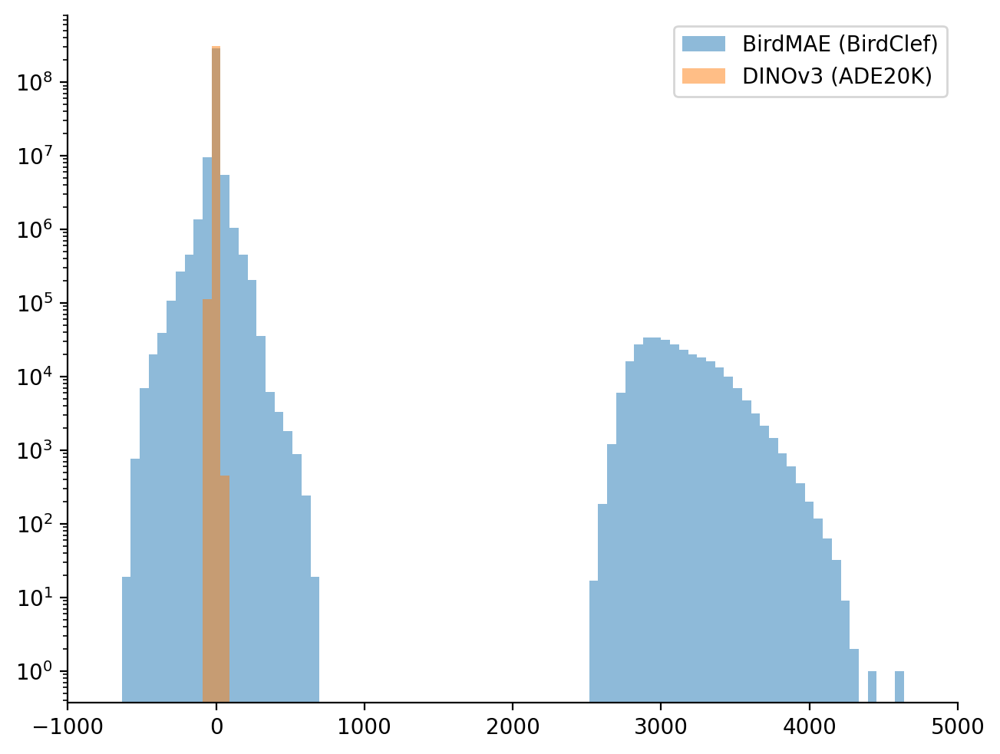
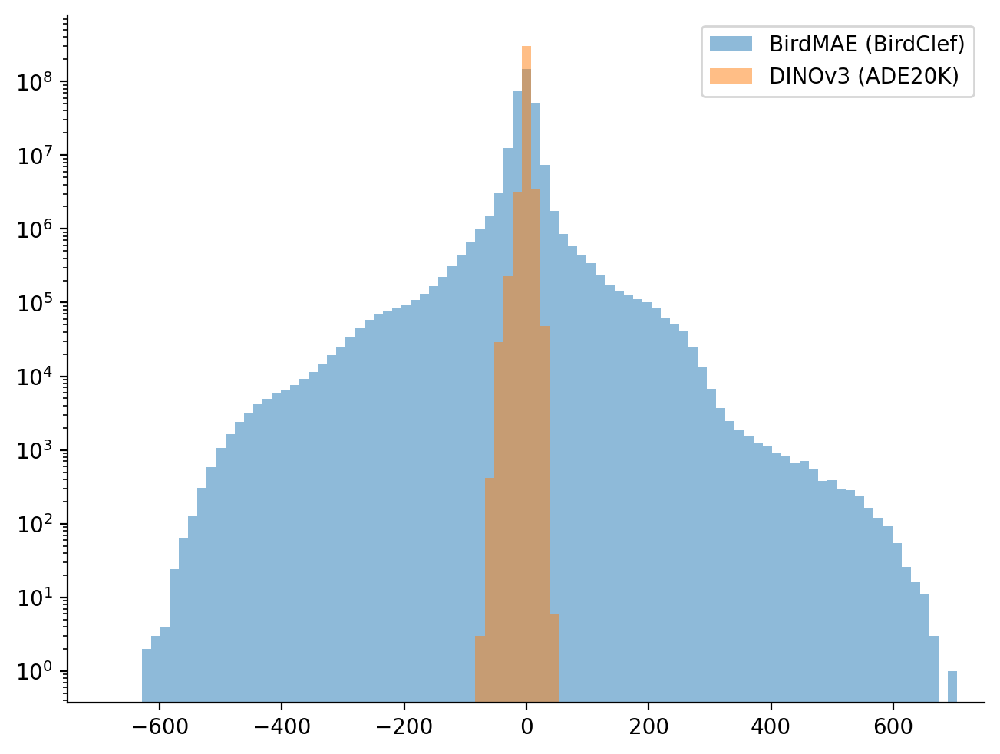
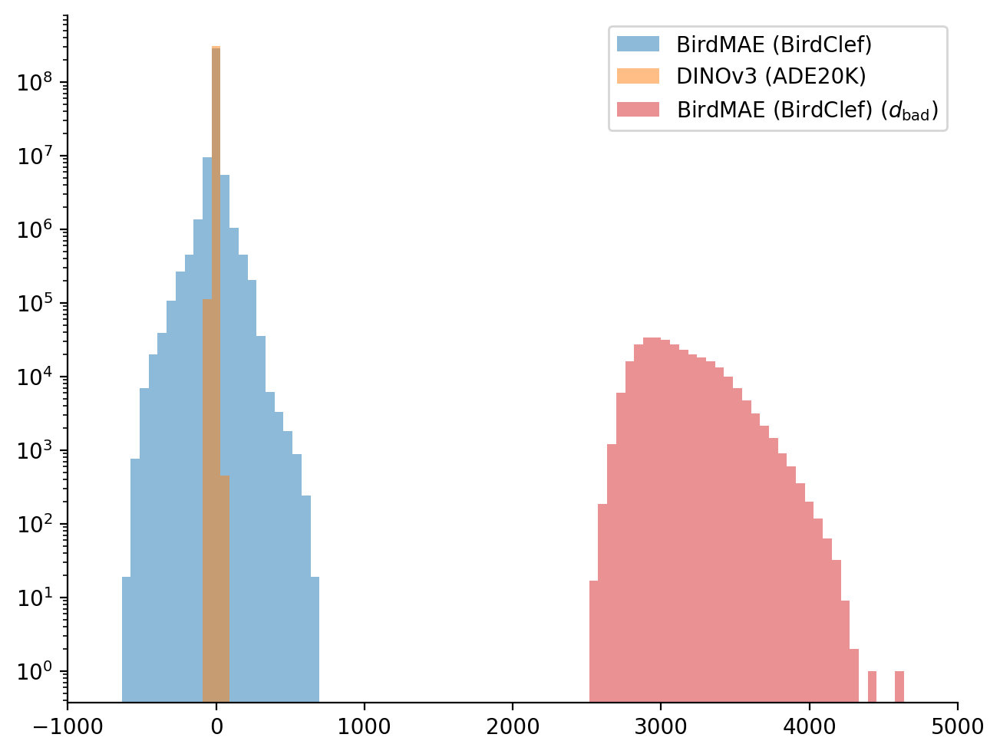
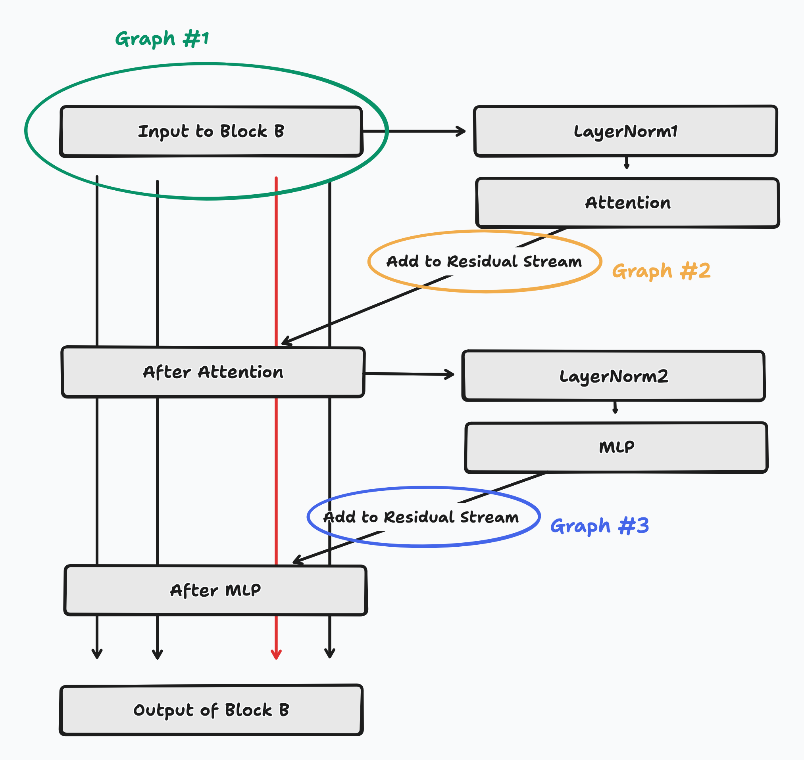
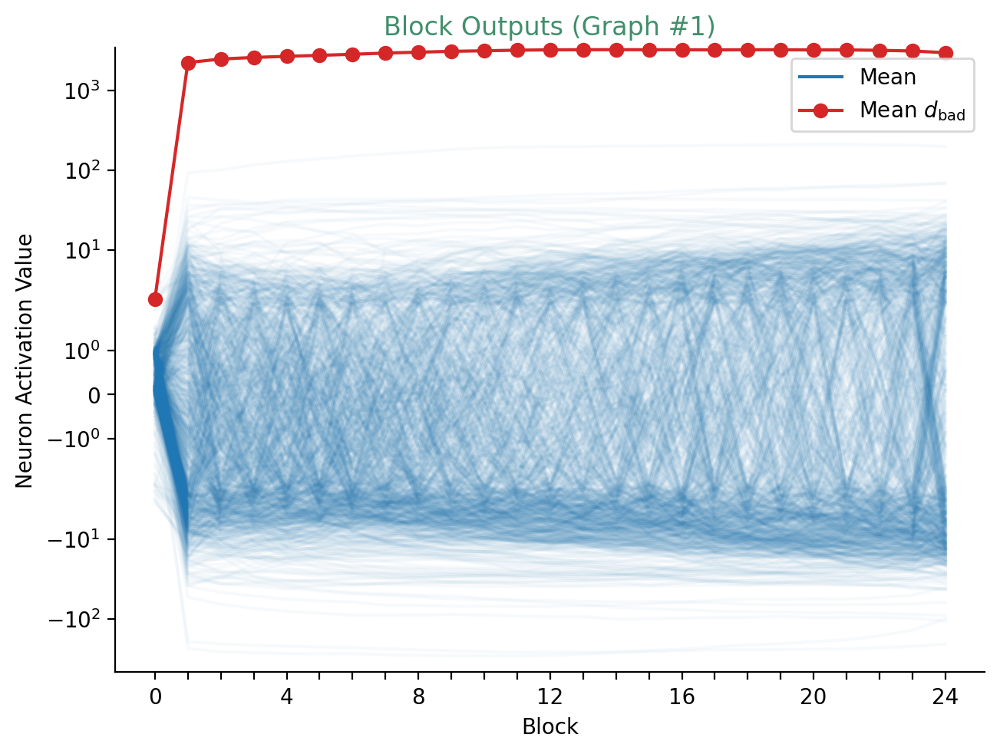
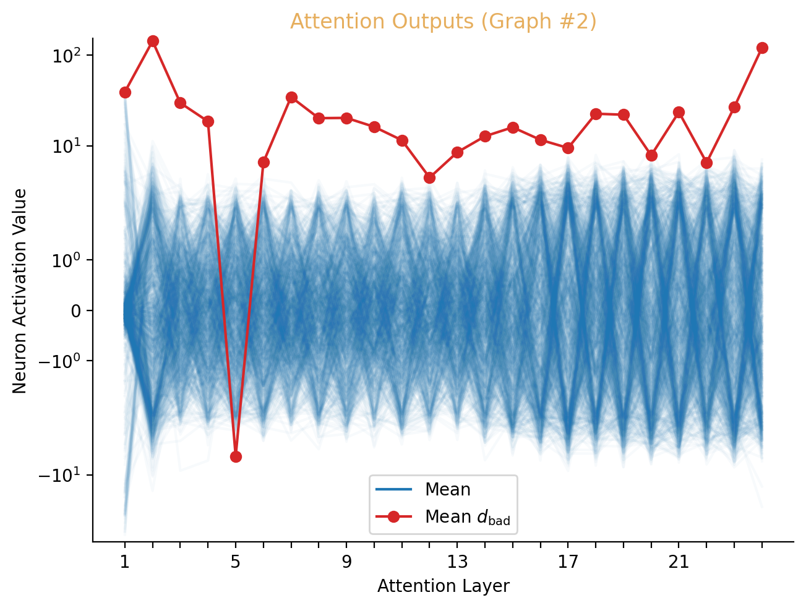
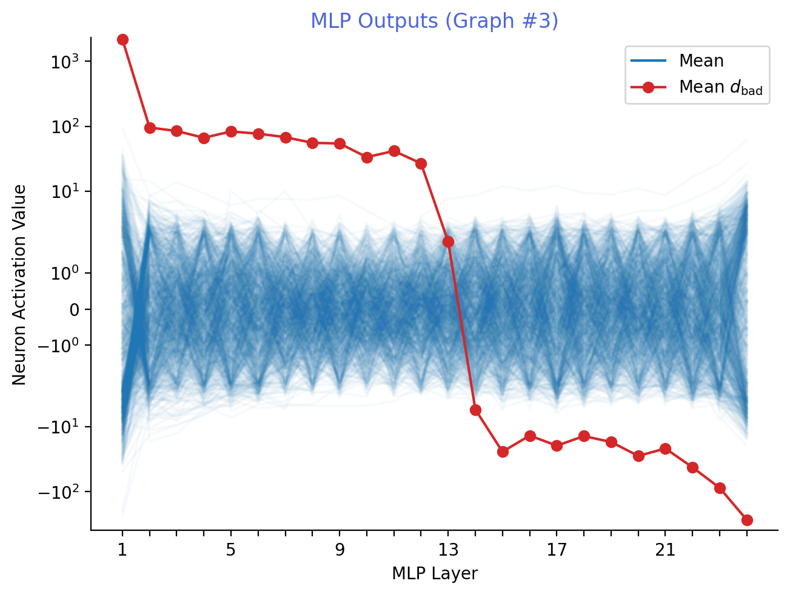
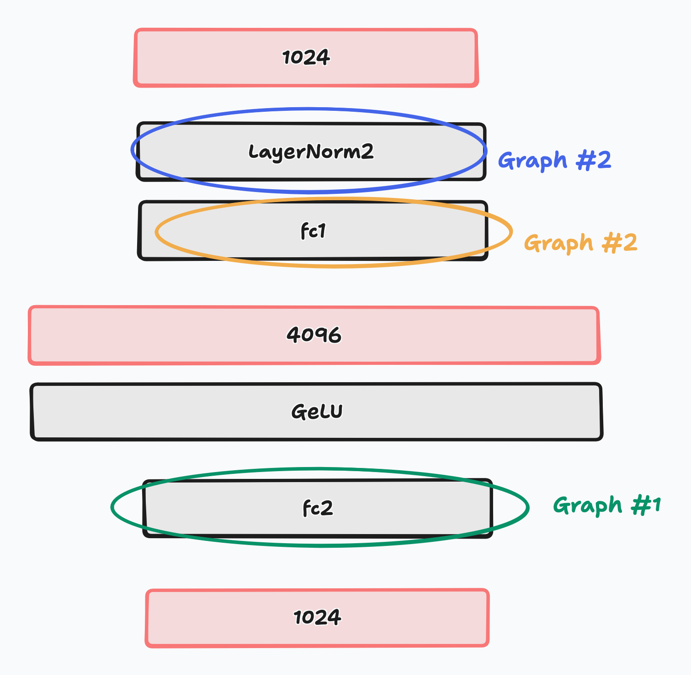

# Debugging Bird-MAE Activations

> This is an example of the kind of debugging you might have to do when training SAEs on a new model. The short version: Bird-MAE has an "emergent outlier feature" in dimension 296 that blows up after the first MLP. The fix is to record activations after the pre-MLP LayerNorm (`block.norm2`) instead of the raw residual stream, because the LayerNorm learns to suppress the outlier.

## Symptom: 80% dead neurons

While training TopK SAEs on [BirdMAE](https://arxiv.org/abs/2504.12880) activations taken from birdsong, ~80% of my neurons were dead from the very start of training.

## Comparing to known-good activations

First, I compared activations from BirdMAE to DINOv3 activations (which I know are well-behaved).
I recorded 300K [content token](glossary.md) activation vectors from layer 14/24 from DINOv3 ViT-L/16 and BirdMAE-L.
Each vector has 1024 dimensions.
I flattened these vectors; for each of BirdMAE and DINOv3, I have a list of 307.2M neuron activations (300K x 1024 = 307,200,000).
I plotted a histogram below. Note the log scale on the y-axis.



I zoomed in on the left-most cluster, ignoring the right cluster.
While BirdMAE is more spread out, the shapes look good enough for now.



## Finding the outlier: dimension 296

Looking at the right cluster, I realized that all of these values are from neuron 296 of 1024.
Here, I colored activations based on their neuron: all BirdMAE neurons besides 296 are blue, DINOv3 is orange, and neuron 296 is red.



My activation matrix is $\mathbb{R}^{300K \times 1024}$ for each dataset. In code, what I see is:

```py
bird_acts.shape  # (300K, 1024)
bird_acts[:, 295].min()  # 2549.54
bird_acts[:, 295].max()  # 4625.12
```

**Something is broken inside of BirdMAE.**

## Tracing the outlier through the residual stream

Where in BirdMAE does this abnormality show up?
Consider transformers as residual streams.
After what layer does dimension 296/1024 blow up?
See this diagram below: for a single random example from BirdMAE, we will track both the average neuron and neuron 296's value through the 24 transformer layers.



BirdMAE uses 256 content tokens for a single example.
We take the average value of each neuron in the residual stream before each transformer block (the green "Graph #1" circle in the above diagram) and after the final transformer block.
We plot each of the 1023 "well-behaved" neurons in light blue.
We plot our degenerate neuron 296 in red.
Note the log scale on the y-axis.



Our well-behaved neurons mostly stay in (-10, 10).
Neuron 296 jumps straight to ~2.2K after the first residual block and is never fixed again.
It's well-behaved coming out of the patch embedding before the first residual block.

## Narrowing it down: the first MLP

Below is the output from the attention layers (Graph #2) in our architecture diagram.



Neuron 296 is mostly well-behaved; it's a little big after the second attention layer, but not insane.



Here, we can see that the output of the **first MLP** produces an abnormally high value for neuron 296.
**Why?**

Here's a architecture diagram of BirdMAE's MLPs according to the [model definition on HuggingFace](https://huggingface.co/DBD-research-group/Bird-MAE-Large/blob/main/modeling_bird_mae.py#L93).
Let's look at the trainable parameters in these MLP across layers, starting from the end and working backwards.



`fc2` has a `weight` parameter with shape (4096, 1024) and a `bias` parameter with shape (1024,).
I take the L2 norm of `fc2.weight`'s columns to see if col 296/1024 is different.


`fc2.weight` does appear to be different, and abnormally large (note the log scale).
`fc2.bias` is also different, but it's not immediately obvious what's going on there to me.

## Root cause: emergent outlier features

This is a known phenomenon in transformers called "emergent outlier features."
After extensive pretraining, a single dimension in the residual stream accumulates a very large magnitude.
The model never needs to "fix" this because the pre-attention and pre-MLP `LayerNormss learn to suppress it: the learned multiplicative weight for dimension 296 is very small, and the bias is approximately 1.
So later layers never actually "see" the outlier in practice.

We verified this by inspecting `norm2.weight` across layers and confirming that the learned scale for dimension 296 is near-zero, but that analysis is not reproduced here.

The BirdMAE authors never had to deal with this because all downstream use of the model goes through LayerNorm first.

## Fix: record after LayerNorm

The fix is to record activations after `block.norm2` (the pre-MLP LayerNorm) instead of from the raw residual stream. In `saev`, this is implemented as:

```py
def get_residuals(self) -> list[torch.nn.Module]:
    return [block.norm2 for block in self.model.blocks]
```

After this change, the outlier is suppressed and SAE training works normally.

## Lessons

1. **Compare activation distributions to a known-good model.** Histogramming flattened activations from 300K tokens is cheap and can reveal outliers.
2. **Emergent outlier features are real.** If a single dimension dominates your activation distribution, check whether it's a known artifact of pretraining before assuming your recording code is wrong.
3. **Record after LayerNorm, not from the raw residual stream.** The residual stream can carry high-magnitude "bookkeeping" values that LayerNorm suppresses. Recording post-norm avoids this entirely.
